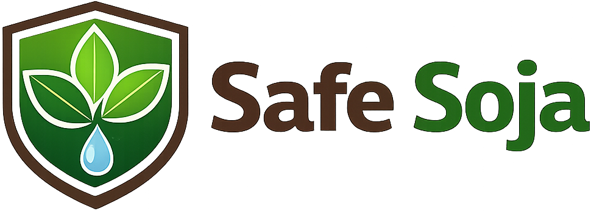
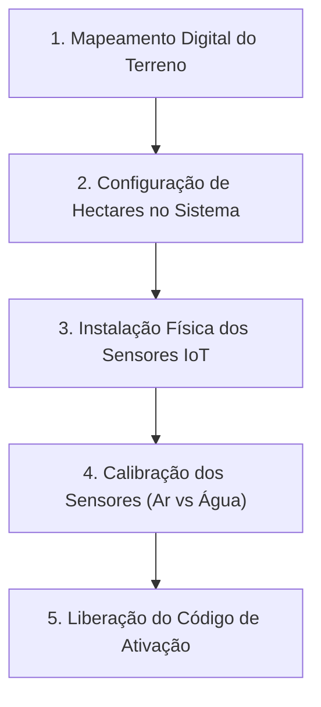
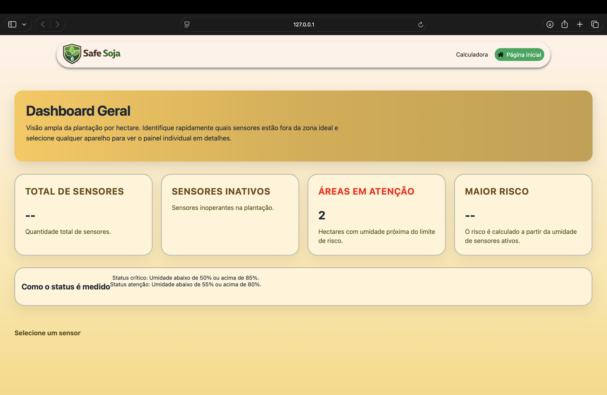
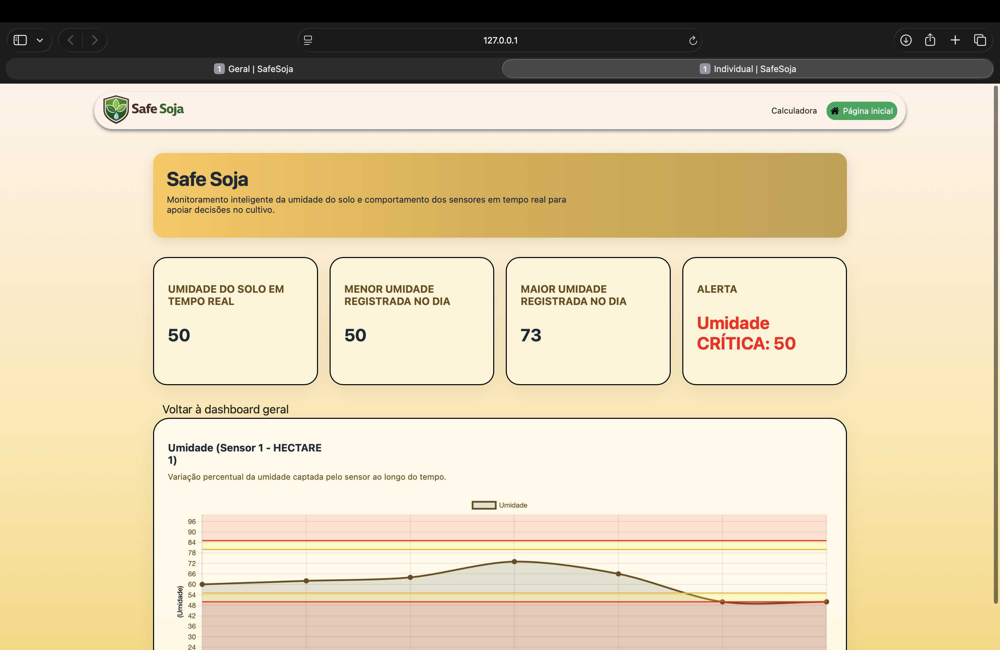

  

# 📖 Manual de Instruções do Cliente — SafeSoja

Bem-vindo ao **SafeSoja**, a solução inteligente de monitoramento de umidade de solo para plantações de soja. Este manual foi desenvolvido com base na identidade visual da nossa plataforma para ajudar você, produtor, a navegar e obter o máximo desempenho de sua lavoura.

> [!NOTE]
> **Implantação Assistida:** Você não precisa se preocupar com configurações técnicas ou instalação física de hardware. Todo o mapeamento do terreno, divisão de hectares, calibração do sensor (entre solo seco e saturado) e conexão com o sistema são realizados **exclusivamente pela equipe técnica da SafeSoja**.

---

## 📌 1. Nosso Modelo de Atendimento

Nossa equipe técnica cuida de todo o processo de implantação em sua propriedade:

* **Instalação Estratégica:** Os sensores são instalados em pontos estratégicos de cada hectare, medindo a umidade na profundidade exata do sistema radicular da soja.
* **Calibração de Precisão:** Cada sensor é calibrado de acordo com a umidade específica do seu tipo de solo, garantindo leituras analógicas confiáveis transformadas em porcentagem (0% a 100%).

---

## 🔑 2. Acesso à Plataforma

Após a conclusão da instalação física, você receberá o seu **Código de Ativação** corporativo (exemplo: `SOJA123`).

### Passo a Passo para Acesso:
1. Acesse o site oficial da **SafeSoja** no seu navegador de preferência.
2. Acesse a página de **Cadastro** (`paginadecadastro.html`).
3. Preencha seus dados de usuário (Nome, E-mail, Senha, CPF, Celular).
4. Insira o **Código de Ativação** fornecido. Isso vinculará automaticamente o seu perfil às leituras dos sensores de sua lavoura.
5. Após cadastrado, faça o **Login** com suas credenciais.

---

## 📊 3. Navegando na Dashboard Geral

O painel geral oferece uma visão ampla de toda a sua lavoura dividida por hectares. 

### Métricas em Destaque:
* **Total de Sensores:** Quantidade de dispositivos ativos e monitorando sua safra.
* **Sensores Inativos:** Indica se algum dispositivo precisa de manutenção física ou troca de bateria.
* **Áreas em Atenção:** Quantidade de hectares operando perto dos limites de risco.
* **Maior Risco:** Identifica instantaneamente qual hectare exige atenção prioritária de irrigação.

---

## 📈 4. Monitoramento Detalhado (Dashboard Individual)

Ao clicar em um sensor específico ou selecioná-lo no menu, você visualiza a variação histórica de umidade em tempo real.

### 🚥 Parâmetros e Zonas de Risco de Umidade

A soja exige entre **450mm e 800mm** de água em seu ciclo. Nosso sistema divide as faixas de umidade do solo para facilitar sua tomada de decisão:

| Status | Faixa de Umidade | Significado | Ação Recomendada |
| :--- | :---: | :--- | :--- |
| **Ideal** | **55% a 80%** | 🟢 Solo com umidade ideal para o desenvolvimento saudável da soja. | Nenhuma ação necessária. |
| **Atenção** | **50% a 54%** ou **81% a 85%** | 🟡 Solo se aproximando do limite de ressecamento ou encharcamento. | Fique atento. Planeje o manejo de irrigação nas próximas horas. |
| **Crítico** | **Abaixo de 50%** ou **Acima de 85%** | 🔴 Risco iminente de estresse hídrico ou de apodrecimento das raízes. | **Ação Imediata:** Acione o sistema de irrigação ou drenagem do talhão afetado. |
| **Inativo** | **Sem dados** | 🔘 Sensor desconectado da rede de monitoramento. | Entre em contato com a equipe de suporte SafeSoja. |

---

## 🤖 5. Assistente Inteligente: BobIA

Se o seu perfil for de Administrador, você terá acesso ao **BobIA**, o nosso assistente virtual de inteligência artificial:

* **Insights Rápidos:** Ele analisa o histórico de registros do banco de dados e sugere melhores momentos para irrigação com base na previsão do tempo e tendências de umidade.
* **Como acessar:** Basta clicar no ícone do BobIA localizado no canto inferior direito da tela.

---

## 🛠️ 6. Suporte Técnico e Central de Help Desk

Se você notar que um sensor está com status **Inativo** (🔘 Cinza) ou se o hardware sofrer qualquer dano físico por maquinário agrícola ou intempéries:

1. **Abra um Chamado:** Na página da plataforma, clique em **Ajuda** para registrar a ocorrência.
2. **Nível 1 (Suporte Remoto):** Validamos se é um problema de conexão, sinal de rede ou API do servidor.
3. **Nível 2 (Manutenção de Campo):** Se houver dano físico, agendamos uma visita técnica para substituição do sensor em sua fazenda.

---

  
SafeSoja — Protegendo o seu solo, cultivando o seu futuro.

